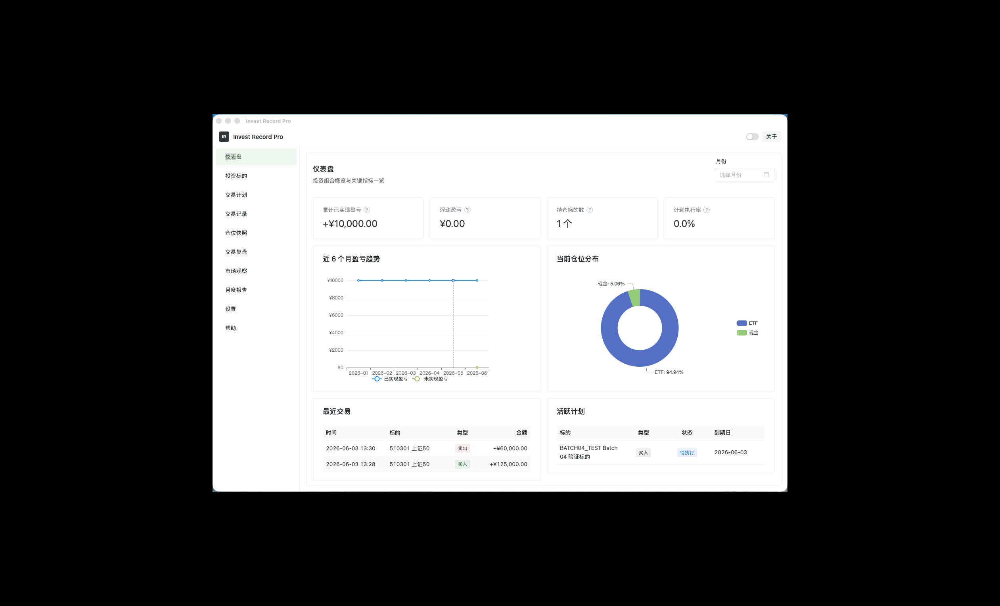
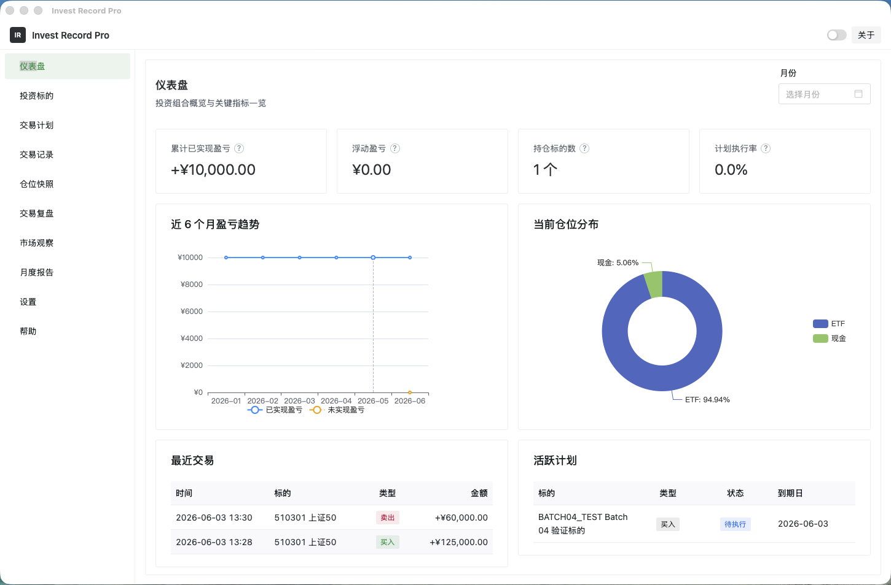
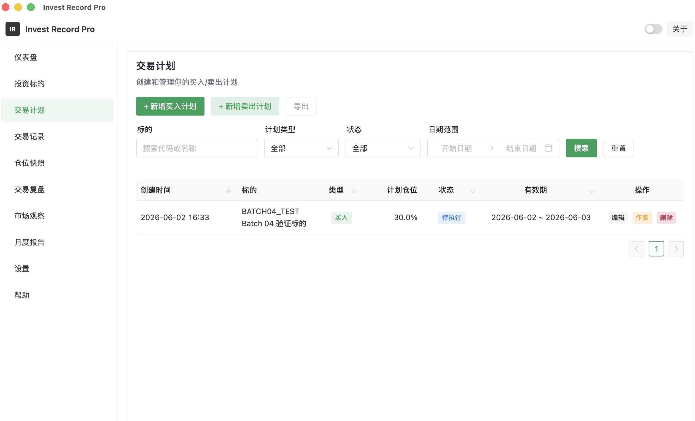
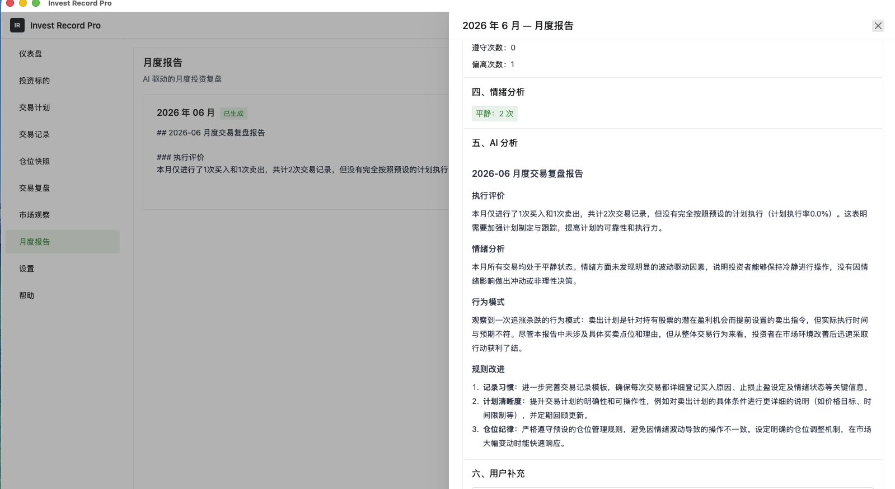

<div align="center">

# Invest Record Pro

**个人投资决策记录系统｜纯本地离线存储｜本地AI智能复盘｜Tauri2跨平台桌面软件**

[](https://opensource.org/licenses/MIT)
[](https://tauri.app/)
[](https://vuejs.org/)
[](https://ollama.ai/)

<!-- 桌面端UI效果 -->


</div>

---

## ✨ 核心特性

- 🔒 **全本地隐私存储**：所有交易记录、持仓快照、AI复盘报告加密存放本机SQLite，**无任何数据联网上传、无云端上报**，从根源规避持仓策略泄露风险
- 🤖 **离线本地化AI分析**：对接Ollama本地大模型，断网环境照常实现单笔交易点评、月度投资复盘、交易纪律诊断
- 📊 **全链路投资闭环**：标的管理 → 交易计划编制 → 交易录入 → 持仓快照留存 → 逐笔复盘 → AI月度报告
- 📏 **交易纪律量化统计**：自动核算交易计划执行率，量化复盘自身交易体系优劣
- 🖥️ **原生桌面级交互**：基于Tauri2构建原生窗口，集成数据表格、盈亏可视化图表、侧边导航，适配高频投资记录场景
- 💾 **轻量化高性能**：Rust后端+嵌入式SQLite，程序秒启动、资源占用低

## 📸 界面预览

| 仪表盘 | 交易计划 | AI 月报 |
|:---:|:---:|:---:|
|  |  |  |

## 🛠️ 技术栈
| 分层 | 技术选型 |
|------|------|
| 桌面基座 | Tauri 2 + Rust |
| 前端框架 | Vue 3 + TypeScript + Vite |
| 状态管理 | Pinia |
| UI组件库 | Naive UI |
| 可视化图表 | vue-echarts(ECharts) |
| 本地数据库 | SQLite(rusqlite 内置打包) |
| 离线AI能力 | Ollama HTTP Fetch |
| 单元测试 | Vitest + @vue/test-utils（132个用例） |
| E2E自动化 | Playwright（89个场景用例） |

## 🏗️ 项目架构
采用 Feature-first 模块化架构，各业务模块低耦合、职责隔离：

```
src/
├── domain/types/          # 领域类型定义（无框架依赖）
├── shared/                # 共享组件与工具
├── services/              # 应用服务（跨模块协调）
├── features/              # 8 个业务模块
│   ├── assets/            # 投资标的（CRUD）
│   ├── plans/             # 交易计划（计划 + 规则）
│   ├── trades/            # 交易记录（买入/卖出）
│   ├── positions/         # 仓位快照（手动记录）
│   ├── reviews/           # 交易复盘（关联交易）
│   ├── market-observations/  # 市场观察
│   ├── monthly-reports/   # AI 月度报告
│   └── settings/         # 系统设置
├── pages/                 # 页面组件（路由级）
├── layouts/               # 布局组件
└── router/                # Vue Router
```

**关键设计决策：**

- **金融精度安全** — 所有金额/价格/数量/百分比使用 INTEGER 存储，禁止 REAL/FLOAT。金额 ×100（分），数量 ×1000，百分比 ×100，指数点位 ×100
- **Rust 严格模式** — clippy 配置 `unwrap_used = "deny"`, `expect_used = "deny"`, `panic = "deny"`
- **模块隔离** — `features/trades` 不导入 `features/plans`，跨模块数据通过 service / DB query

## 📋 页面

| 页面 | 路由 | 功能 |
|------|------|------|
| 仪表盘 | `/dashboard` | 盈亏统计、近 6 月趋势图、仓位分布、最近交易、活跃计划 |
| 投资标的 | `/assets` | 标的 CRUD，支持股票/ETF/基金/指数/可转债 |
| 交易计划 | `/plans` | 计划制定、触发规则、执行跟踪、状态管理 |
| 交易记录 | `/trades` | 买入/卖出录入、情绪标记、计划关联、多维筛选 |
| 仓位快照 | `/positions` | 手动记录持仓快照、市值与浮动盈亏 |
| 交易复盘 | `/reviews` | 逐笔交易复盘、结果评价、AI 辅助分析 |
| 市场观察 | `/market-observations` | 大盘点位、市场情绪、重大事件记录 |
| 月度报告 | `/monthly-reports` | AI 生成月度投资总结、人工编辑、导出 |
| 设置 | `/settings` | Ollama 模型配置、数据备份/恢复、主题切换 |

## 🚀 快速开始

### 开发者

```bash
git clone https://github.com/brycegao/invest-record-pro.git
cd invest-record-pro
npm install
npm run tauri dev
```

### 前置条件

- [Node.js](https://nodejs.org/) >= 18
- [Rust](https://rustup.rs/) (stable)
- [Tauri Prerequisites](https://tauri.app/start/prerequisites/)
- [Ollama](https://ollama.ai/)（可选，用于 AI 功能）

### 开发命令

```bash
npm run dev              # Vite 开发服务器 (port 1420)
npm run build            # vue-tsc + vite build
npm run check            # lint + type-check + format:check
npm run check:fix        # lint:fix + format
npm run test             # Vitest 单元测试 (132 tests)
npm run test:e2e         # Playwright E2E 测试 (89 tests)
npm run test:e2e:ui      # Playwright UI 模式
```

### 普通用户

从 [GitHub Releases](https://github.com/brycegao/invest-record-pro/releases) 下载安装包。

支持平台：Windows 10/11、macOS


## 💬 Community / 社区

- [GitHub Discussions](https://github.com/brycegao/invest-record-pro/discussions) — Feature requests, feedback, Q&A
- [GitHub Issues](https://github.com/brycegao/invest-record-pro/issues) — Bug reports


## 版本说明
- 当前正式版本：V1.0.0   
- 开发分支：dev/v1.0.0，稳定代码合并至main分支

## 后续规划
- v1.1.0：新增K线批量导入、自定义技术指标统计
- 持续优化AI分析精准度

## 📄 License

This project is licensed under the MIT License. See the [LICENSE](LICENSE) file for details.

---

<div align="center">

**个人投资决策记录系统・纯本地存储・离线 AI 分析・Tauri 2 桌面应用**

</div>
